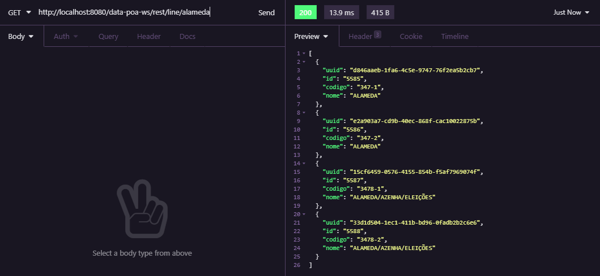
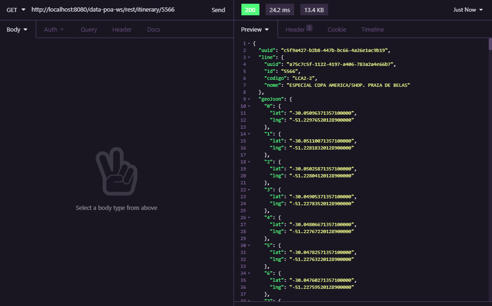
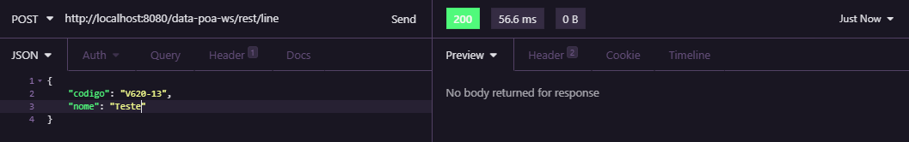
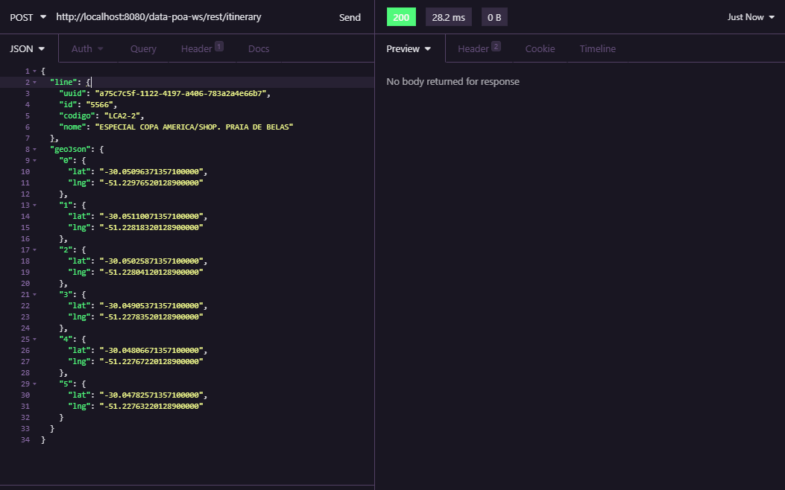
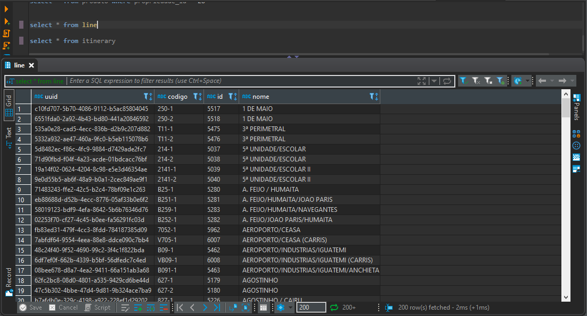
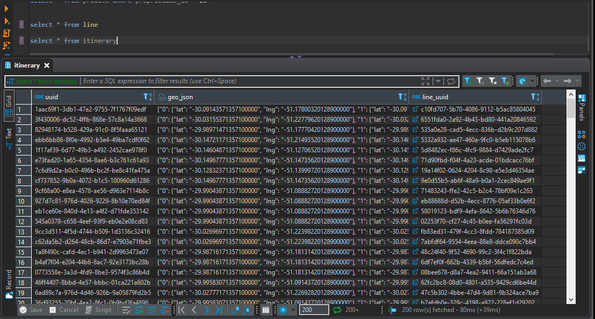

# DataPoaWS

## Escopo

Este projeto é uma aplicação integrada com a API do DataPoa: http://datapoa.com.br/group/about/mobilidade.

Esta aplicação fornece APIs para:
- busca de linhas através de filtro por nome
- busca de itinerário de uma determinada linhas
- crud de linhas e itinerários possibilitando a inserção de novas linhas e itinerários

Esta aplicação está configurada para atualizar os dados junto ao DataPoa a cada 24h.
Assim se algum dado for inserido, modificado ou excluído na API a aplicação também irá atualizar sua base de dados
mantendo assim a confiabilidade dos dados.

### API para busca da linha com filtro por nome

	

### API para busca do itinerário de uma determinada linha

	

### API para inserção de uma nova linha

	

### API para inserção de um novo itinerário

	

### Tabela de linhas no banco

	

### Tabela de itinerários no banco

	

## Tecnologias

- Java: 11
- Spring Boot: 2.1.0.RELEASE
- Hibernate-types-52: 4.6.0

## Como instalar

- Baixe ou clone este repositório usando `git clone https://github.com/geisonfeitosa/data-poa-ws.git`.
- Crie uma base de dados PostgreSQL com o nome data-poa-ws, username: postgres e password: 123456.

# DataPoaWS